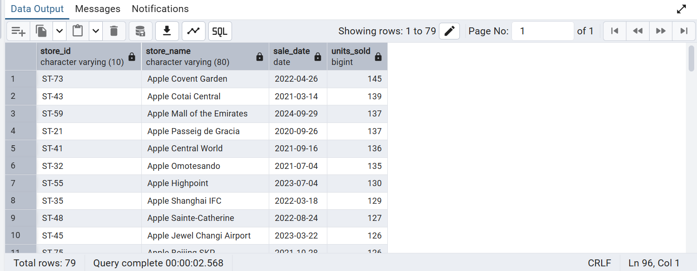
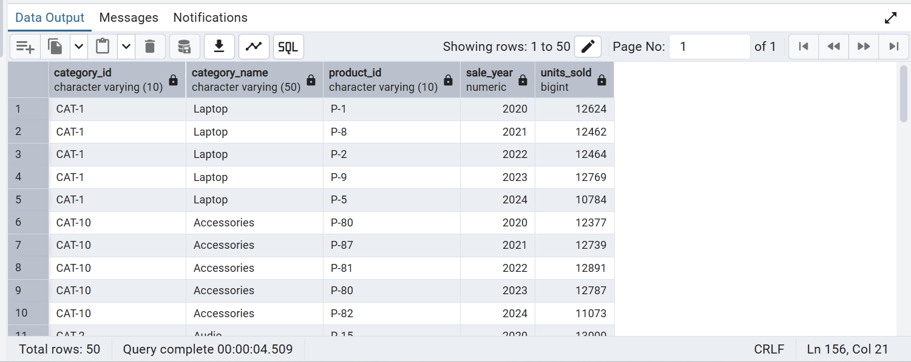
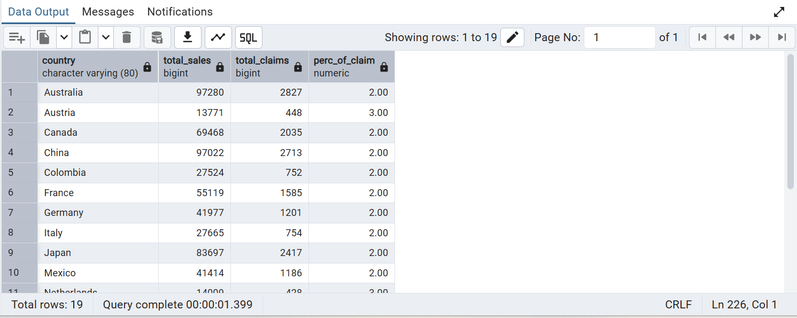
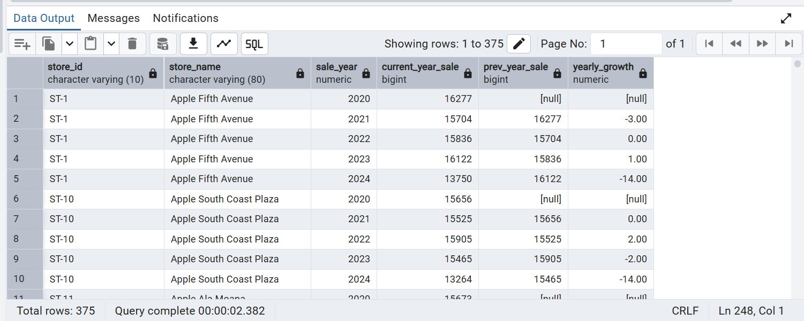
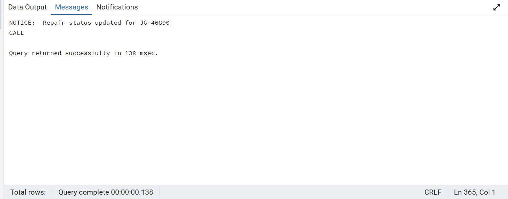

# PostgreSQL Apple Sales & Warranty Analysis

End-to-end PostgreSQL analytics project focused on analyzing Apple retail sales, store performance, product trends, and warranty behavior using advanced SQL concepts.

---

## Project Overview

This project answers real-world business questions such as:
- Which stores and products perform best over time?
- How do sales trends change year-over-year?
- What is the probability of warranty claims across countries?
- How soon after purchase do warranty claims occur?
- How can warranty operations be automated using SQL?

All analysis is performed using **PostgreSQL (pgAdmin 4)**.

---

## Database Schema

The project uses five normalized tables:

- `category` – Product categories  
- `products` – Product details and launch dates  
- `stores` – Store locations and countries  
- `sales` – Transaction-level sales data  
- `warranty` – Warranty claims linked to sales  

Relationships are enforced using primary and foreign keys.

---

## Key Analysis & Insights

### Q10: Best Selling Day for Each Store
Identifies the highest-selling day for every store using CTEs and window functions.

---

### Q11: Least Selling Product by Category and Year
Finds underperforming products per category for each year using DENSE_RANK.

---

### Q16: Warranty Claim Percentage by Country
Calculates the probability of receiving a warranty claim after purchase for each country.

---

### Q17: Year-over-Year Sales Growth per Store
Analyzes yearly sales growth trends using LAG to compare with previous year performance.

---

### Q19: Monthly Running Total of Sales
Tracks monthly sales value and cumulative running totals using DATE_TRUNC and window functions.

---

### Q20: Warranty Status Update Stored Procedure
Implements a PL/pgSQL stored procedure to validate and update warranty repair status with proper system notices.

---

## SQL Concepts Used

- INNER and LEFT JOINs  
- Aggregations (SUM, COUNT, AVG)  
- Date and time functions (EXTRACT, DATE_TRUNC, INTERVAL)  
- Window functions (DENSE_RANK, LAG, RUNNING TOTAL)  
- Common Table Expressions (CTEs)  
- Conditional logic (CASE WHEN)  
- Indexing for performance optimization  
- Stored Procedures using PL/pgSQL  
- Error handling with RAISE NOTICE  

---

## How to Run This Project

1. Create a PostgreSQL database  
2. Run the schema file to create tables  
3. Insert the dataset  
4. Execute queries from `queries.sql`  
5. View results in pgAdmin and refer to screenshots in `/outputs`

---

## Project Structure

postgres-apple-sales-analysis/
│
├── schema.sql
├── queries.sql
├── README.md
│
├── erd/
│   └── apple_sales_erd.png
│
└── outputs/
    ├── q10_best_selling_day_per_store.png
    ├── q11_least_selling_product_by_category_year.png
    ├── q16_warranty_claim_percentage_by_country.png
    ├── q17_yoy_sales_growth_per_store.png
    ├── q19_monthly_running_total_sales.png
    └── q20_update_warranty_status_procedure.png

---

## Key Takeaways

- Demonstrates intermediate to advanced SQL skills  
- Covers both analytical and operational SQL use cases  
- Uses realistic retail and warranty datasets  
- Suitable for Data Analyst, Business Analyst, and SQL-focused roles  
